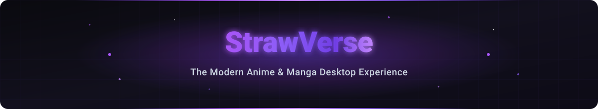

<h6 align="right">Supports Android, Windows & Linux</h6>
<h1 align="center">
  
</h1>

# StrawVerse

> **A fast, open-source anime and manga downloader for Windows, Linux, and Android with batch downloads, subtitles, multiple sources, quality selection, and MyAnimeList integration.**

<p align="center">
  <a href="https://github.com/TheYogMehta/StrawVerse/stargazers">
    
  </a>
  <a href="https://github.com/TheYogMehta/StrawVerse/releases">
    
  </a>
  <a href="https://github.com/TheYogMehta/StrawVerse/blob/main/LICENSE">
    
  </a>
  <a href="https://discord.gg/PzfUBgQ2gt">
    
  </a>
</p>

StrawVerse is a fast, open-source **anime downloader** and **manga downloader** designed for Windows, Linux, and Android. Built for speed, versatility, and offline media management, StrawVerse enables you to search, stream, read, and perform **batch anime downloads** and manga chapter downloads across multiple high-speed sources.

Whether you want high-speed **anime download** queues in 1080p, full Sub and Dub subtitle extraction, or automatic MyAnimeList synchronization, StrawVerse brings your entire **anime & manga** library together under one powerful open-source platform.

<p align="center">
  <a href="https://github.com/TheYogMehta/StrawVerse/releases"><b>Download StrawVerse</b></a> • 
  <a href="https://strawverse.theyogmehta.online"><b>Official Website</b></a> • 
  <a href="https://discord.gg/PzfUBgQ2gt"><b>Join Community Discord</b></a>
</p>

---

## Quick Download

| Platform    | Download Link                                                              | Format                           | OS Compatibility             |
| :---------- | :------------------------------------------------------------------------- | :------------------------------- | :--------------------------- |
| **Windows** | [StrawVerse.Setup.exe](https://github.com/TheYogMehta/StrawVerse/releases) | Installer (`.exe`)               | Windows 10, 11 (64-bit)      |
| **Linux**   | [StrawVerse.AppImage](https://github.com/TheYogMehta/StrawVerse/releases)  | Portable (`.AppImage` / `.snap`) | Ubuntu, Fedora, Arch, Debian |
| **Android** | [StrawVerse.apk](https://github.com/TheYogMehta/StrawVerse/releases)       | Mobile APK (`.apk`)              | Android 7.0+                 |

---

## Features

- **Batch Anime Episode Downloads:** Download complete anime series, seasons, or selected episodes in bulk with parallel queue processing.
- **Manga Chapter Downloads:** Download manga volumes and chapters into CBZ format or structured image directories for offline reading.
- **Fast Parallel Engine:** Multi-threaded download acceleration optimized for minimum wait times and max bandwidth usage.
- **Multiple Video Qualities:** Seamless quality selection (360p, 480p, 720p, 1080p FHD) with automatic resolution fallback.
- **Sub & Dub Support:** Full access to Japanese audio streams with subtitles (Sub) and English Dubbed anime releases.
- **Flexible Subtitle Handling:** Extract soft subtitles as raw `.vtt` / `.ass` files or merge them directly into `.mp4` containers.
- **In-App Player & Reader:** Stream anime directly with a built-in HTML5 video player or read manga with customizable layouts.
- **MyAnimeList Integration:** Authenticate via MAL OAuth to automatically track watched episodes, read chapters, and sync lists.
- **Cross-Platform Support:** Unified desktop and mobile client experience across Windows, Linux, and Android.
- **Free & Open Source:** 100% community-driven under GPL-3.0 without advertisements or locked features.

---

> [!IMPORTANT]
> **Legal Disclaimer:** StrawVerse is an open-source local media manager and indexing application designed for developers and researchers. The developers of this application do not host, store, stream, or distribute any copyrighted media (video, audio, or images). The application functions solely as a client-side parser and downloader wrapper utilizing publicly available web resource links. We do not condone, promote, or encourage copyright infringement. By using this software, you acknowledge and agree that all download and media-access activities are conducted at your own risk and responsibility, and that you are solely responsible for ensuring compliance with all local, national, and international copyright laws and terms of service.

## Table of Contents

- [Overview](#overview)
- [Key Features](#key-features)
- [System Requirements](#system-requirements)
- [Installation](#installation)
- [Usage](#usage)
- [Videos](#videos)
- [Configuration](#configuration)
- [Uninstalling the Application](#uninstalling-the-application)
- [Build the Application](#build-the-application)
  - [Prerequisites](#prerequisites)
  - [Steps to Build](#steps-to-build)

---

## Overview

**StrawVerse** is a cross-platform application built with Electron, Capacitor, React, and Vite that allows you to stream, read, download, and track your anime and manga collections. It uses a local SQLite database to manage your library and watch history.

Beyond standard downloading, StrawVerse includes real-time playback synchronization with friends (Watch Together), automatic MyAnimeList synchronization, a built-in media player, and a manga reader.

---

## Key Features

- **Watch Together:** Host or join rooms to watch anime synchronously with friends (includes shared queue and text chat).
- **In-App Player & Reader:** Stream anime directly or read manga chapters in the app. Remembers your playback position and layout preferences.
- **Bulk Downloading:** Download entire seasons of anime or manga volumes at once, with support for merging subtitles directly into video files.
- **Library Tracker:** Tracks your progress (time watched, chapters read) and automatically updates your MyAnimeList account.
- **Discord Status:** Shows your current show or manga on your Discord profile.

---

## System Requirements

- **Operating System:** Android, Windows & Linux

## Installation

### For Android

1. Go to [StrawVerse Releases](https://github.com/TheYogMehta/StrawVerse/releases).
2. Download the APK file `StrawVerse-<version>.apk`.
3. Open and install the APK on your Android device!

### For Windows

1. Go to [StrawVerse Releases](https://github.com/TheYogMehta/StrawVerse/releases).
2. Download the setup file `StrawVerse.Setup.<version>.exe`.
3. Run the installer to install the application, and enjoy!

### For Linux

1. Go to [StrawVerse Releases](https://github.com/TheYogMehta/StrawVerse/releases).
2. Download the AppImage `StrawVerse-<version>.AppImage` or the snap / deb / zip package.
3. For AppImage: Make it executable using `chmod +x StrawVerse-<version>.AppImage` and run it.

### For Other OS (macOS, etc.)

- Pre-built binaries are not currently provided. You can run the application by cloning the repository, installing the dependencies, and running it locally. See the **[Build the Application](#build-the-application)** section below for step-by-step instructions.

## Usage

1. Run the application (`StrawVerse.exe` on Windows, or `StrawVerse.AppImage` / Snap on Linux).
2. **Search and Discover:** Use the unified Discover page to search across anime or manga, switching search modes with the header toggle slider.
3. **Stream or Read:** Select a title to watch instantly in the custom HTML5 video player, or read chapters in the built-in manga reader.
4. **Synchronized Playback:** Jump to the **Watch Together** tab to host or join a synced watch room with friends.
5. **Bulk Download:** Select episodes/chapters from the detail view, choose your format (Sub/Dub/HSUB), and track queues in the Downloads tab.

## Videos

### How to download `StrawVerse.exe`?

[Download Guide Video](https://github.com/Incredibleflamer/Anime-batch-downloader-gui/assets/84078595/662413b3-cf34-49d1-a99d-4c5e42330d05)

### How to download anime from `StrawVerse.exe`?

[Anime Download Guide Video](https://github.com/Incredibleflamer/Anime-batch-downloader-gui/assets/84078595/24c68567-aaf5-4953-bda7-8fcec50e193c)

## Configuration

Navigate to the settings tab to configure your StrawVerse application:

1. **MyAnimeList Integration:** Authenticate your MAL account via OAuth to enable plan-to-watch/plan-to-read automatic list tracking.
2. **Player Settings:** Configure subtitle styling and downloading preferences. Hianime provider streams support subtitle track extraction—choose to save subtitle tracks as raw external files or merge them directly into the output MP4 container.
3. **Quality Preferences:** Customize preferred resolution fallbacks for scrapers.
4. **Server & Mapping URL:** Reset or configure the address of the central mapping server. Verify connection endpoints with the integrated health test control.
5. **Storage & Cache:** Set size limits for poster image disk caching (default 5GB). The app implements LRU cache eviction and automatically purges cached assets older than 6 days.

## Uninstalling the Application

### For Windows

To delete the application, navigate to the following directory:

```
C:\Users\USERNAME\AppData\Local\Programs\StrawVerse
```

Then, run `Uninstall StrawVerse.exe`.

### For Linux

- **AppImage:** Simply delete the downloaded `.AppImage` file. If you want to clean up application configurations, delete the `~/.config/strawverse` directory.
- **Snap:** Run the following command in your terminal:
  ```bash
  sudo snap remove strawverse
  ```

---

# Build the Application

Follow these steps to build application:

## Prerequisites

1. **Download and install Node.js**:
   - [Node.js Download](https://nodejs.org/)

2. **Download and install Git**:
   - [Git Download](https://git-scm.com/)

3. **Download and install Python**
   - [Python Download](https://www.python.org/downloads/)

4. **C++ Build Tools (Windows only, required for compiling native SQLite node modules via node-gyp)**
   - During the Node.js installation on Windows, make sure you check the box that says **"Automatically install the necessary tools"** (this installs Python and the necessary VS Build Tools via Chocolatey automatically).
   - Alternatively, you can manually download and install **[Visual Studio Build Tools](https://visualstudio.microsoft.com/visual-cpp-build-tools/)** (be sure to select the **Desktop development with C++** workload during setup).

## Steps to Build

1. Clone the repository:

   ```bash
   git clone https://github.com/TheYogMehta/StrawVerse.git
   ```

2. Navigate to the project directory:

   ```bash
   cd StrawVerse/electron
   ```

3. Install dependencies:

   ```bash
   npm install
   ```

4. For Building the application:

   ```bash
   npm run package
   ```

5. Run the application for testing:
   ```bash
   npm run start
   ```

## Notes

- Build (package): Creates installer/executable files for Windows (`.exe`) and Linux (`.AppImage`, `.snap`) in the `dist` directory.
- Start: Runs the app locally in the Electron environment without building an executable.
- Ensure that your system has the latest versions of Node.js and Git installed for compatibility.
- If you encounter any issues, feel free to open an issue or join our [Discord Server](https://discord.gg/PzfUBgQ2gt) for support and chat!

---

# Build and Run the Android Application

Follow these steps to build and run the application on Android:

## Prerequisites

1. **Android SDK / Android Studio** installed.
2. A connected **Android device** (with USB Debugging enabled) or an **emulator** running.
3. Node.js & npm installed.

## Steps to Build and Run

1. **Install Dependencies**:

   In the repository root:

   ```bash
   npm install
   ```

   Go into the `capacitor` folder and install its dependencies:

   ```bash
   cd capacitor
   npm install
   ```

2. **Sync Android Project**:

   Build GUI, bundle backend, fetch dependencies, and sync with Capacitor:

   ```bash
   npm run sync:android
   ```

3. **Build Android APK**:

   ```bash
   npm run package:android
   ```

   _(Outputs signed release APK to `capacitor/android/app/build/outputs/apk/release/app-release.apk`)_

4. **Run the Application**:
   - **Option A**: Directly from the terminal:
     ```bash
     npx cap run android
     ```
   - **Option B**: Using Android Studio:
     ```bash
     npx cap open android
     ```
